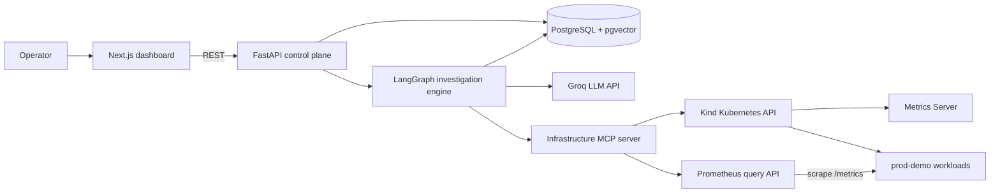
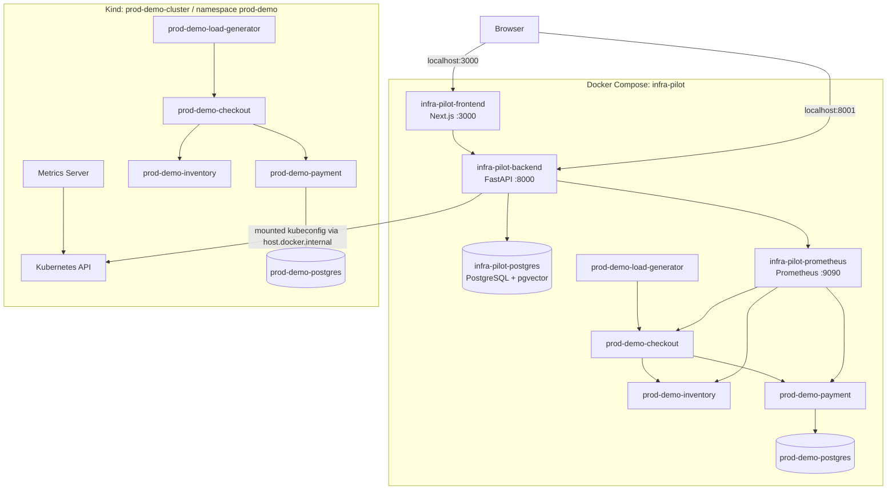
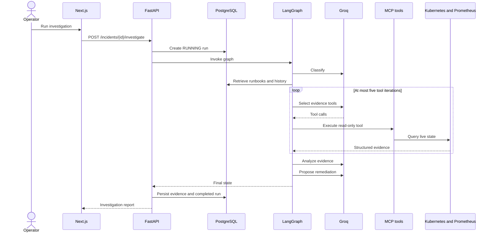
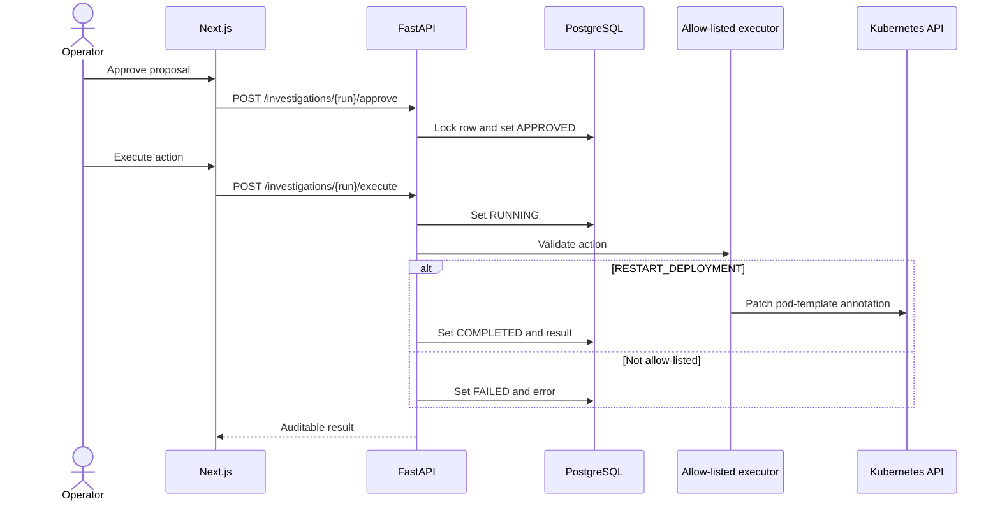

# High-Level Design

## System context

InfraPilot is a control plane around a monitored Kubernetes workload. It owns
incidents, investigations, knowledge retrieval, and approval state. Kubernetes
and Prometheus remain the sources of live operational evidence.

## Runtime topology

## Hybrid-runtime behavior

The local design has two representations of the demo workload:

1. Compose services generate traffic and expose application metrics to the
   Compose Prometheus server.
2. Kind Deployments provide pods, events, logs, deployment health, and resource
   metrics to the Kubernetes inventory and MCP tools.

The Services API merges those sources by service name. Kubernetes supplies the
inventory; Prometheus enriches `prod-demo-payment` with 5xx and p95 values. This
is useful locally but is not a single-cluster production monitoring design.

## Investigation flow

## Remediation flow

## External dependencies

- Groq models through `langchain-groq`.
- Kubernetes through the official Python client.
- Prometheus HTTP query API.
- MCP over a local stdio subprocess.
- Sentence Transformers for local embeddings.
- PostgreSQL with pgvector.

## Availability model

Investigations run inside the API process. A synchronous investigation occupies
one HTTP request until completion. There is no queue, worker service, scheduler,
or durable graph checkpoint. PostgreSQL becomes authoritative after state is
persisted.
