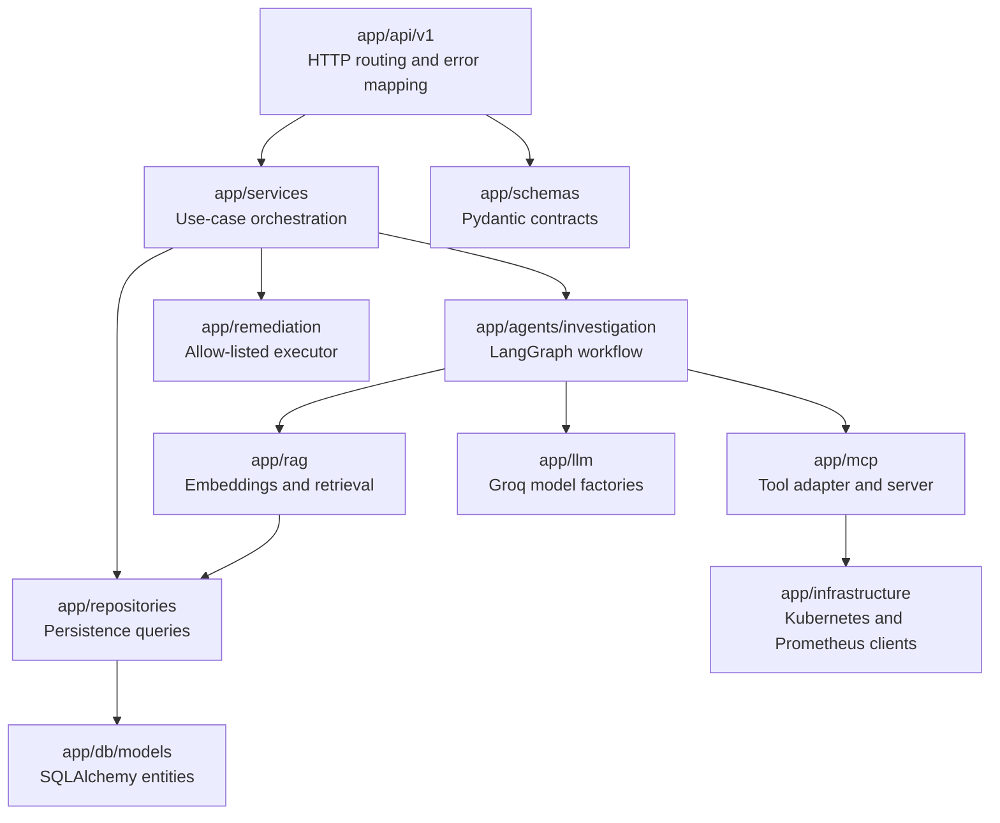
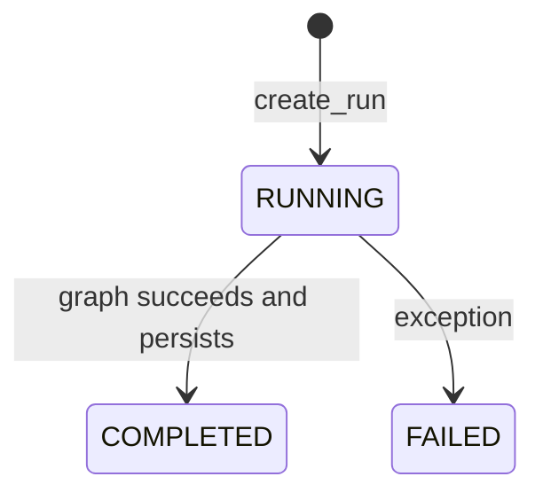
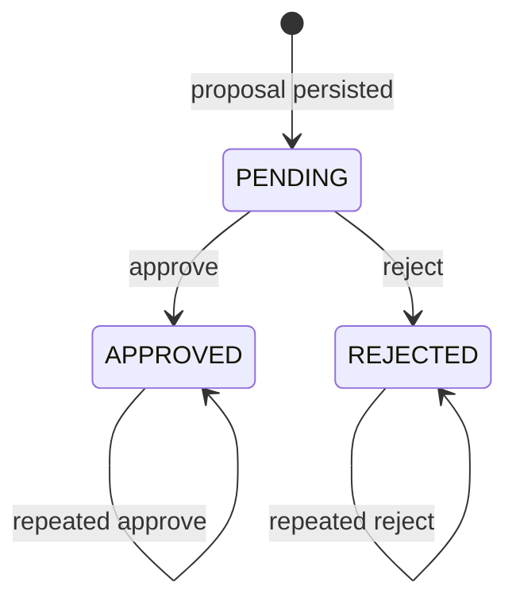
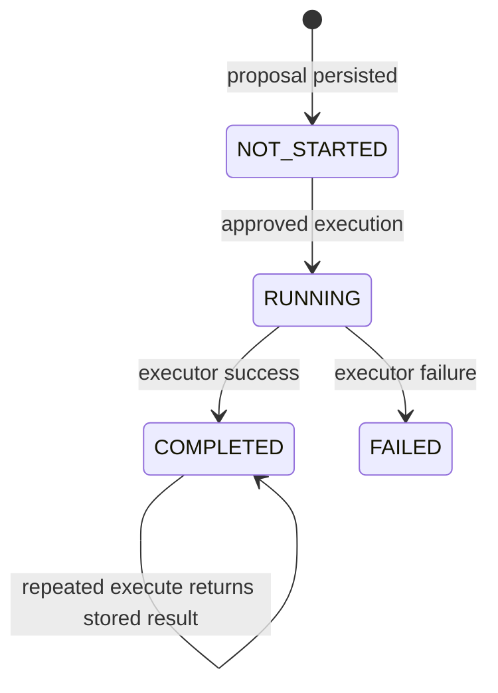

# Low-Level Design

## Backend layering



## Entry point and configuration

`app/main.py` creates FastAPI, permits CORS from local port 3000, and mounts all
routers under `/api/v1`. `app/core/config.py` uses case-insensitive environment
variables with `.env` as the local default source.

Required runtime settings are `DATABASE_URL` and `GROQ_API_KEY`. Important
defaults are:

- tool-calling model: `LLM_MODEL` (defaults to `openai/gpt-oss-120b`)
- tool-calling fallback: `LLM_FALLBACK_MODEL` (defaults to `openai/gpt-oss-20b`)
- strict structured-output model: `LLM_STRUCTURED_MODEL` (defaults to `openai/gpt-oss-120b`)
- structured-output fallback: `LLM_STRUCTURED_FALLBACK_MODEL` (defaults to `openai/gpt-oss-20b`)
- Kubernetes context: `kind-prod-demo-cluster`
- namespace: `prod-demo`
- Prometheus URL: `http://localhost:9090` outside Compose

Compose overrides database, Prometheus, Kubernetes host, and API URLs with
container-network values.

## Module responsibilities

### API layer

- `health.py`: application health response.
- `incidents.py`: CRUD, synchronous investigation, SSE graph progress, and
  per-incident run history.
- `investigations.py`: run list/detail, audit list, approval, rejection, and
  execution.
- `runbooks.py`: indexed runbook catalog.
- `services.py`: Kubernetes inventory plus Prometheus enrichment.

### Service layer

- `IncidentService`: incident CRUD orchestration.
- `InvestigationService`: run lifecycle, graph invocation, persistence,
  historical context, approval transitions, execution, and SSE event mapping.
- `RunbookService`: semantic retrieval and catalog grouping.
- `ServiceInventoryService`: joins Deployments to Pods by labels, tolerates
  unavailable Metrics Server/events, and enriches payment metrics.

### Repository layer

- `IncidentRepository`: create, get, newest-first list, and delete.
- `InvestigationRepository`: runs, evidence, row locks, history, and audit.
- `RunbookRepository`: pgvector cosine search and catalog listing.

Write methods commit their own transactions. There is no explicit unit of work
spanning several repository methods.

### Infrastructure layer

`kubernetes_client.py` loads the named kubeconfig context for each client. In
Docker it rewrites the API host to `host.docker.internal`, preserves the port,
and uses `localhost` as the TLS server name.

`prometheus_client.py` issues instant PromQL queries and returns the first vector
value as a float or `None`.

### LLM and MCP layers

Groq models run at temperature zero. Structured calls use Pydantic output;
tool-selection calls bind the LangChain tools. Both fall back only when the
primary raises `RateLimitError`.

The MCP server is started through stdio using:

```text
uv run mcp run app/mcp/servers/infrastructure.py
```

Each LangChain tool invocation creates and closes a new MCP stdio session.

## Domain state machines

### Investigation



### Approval



Approved proposals cannot be rejected, and rejected proposals cannot be
approved.

### Remediation



`RUNNING` and `FAILED` executions cannot be retried through the current service.

## Concurrency and error rules

- Approval, rejection, and execution use `SELECT ... FOR UPDATE`.
- Missing entities map to HTTP 404.
- Invalid state transitions map to HTTP 409.
- Groq rate limiting maps to HTTP 429 on the synchronous endpoint.
- Kubernetes inventory failures map to HTTP 503.
- Investigation exceptions persist `FAILED` and then propagate.
- Incident creation and investigation start do not accept idempotency keys.

## Async behavior

SQLAlchemy uses async sessions. Blocking Kubernetes calls are moved to
`asyncio.to_thread` in inventory and remediation paths, while MCP server tool
functions execute synchronously inside the MCP subprocess.
