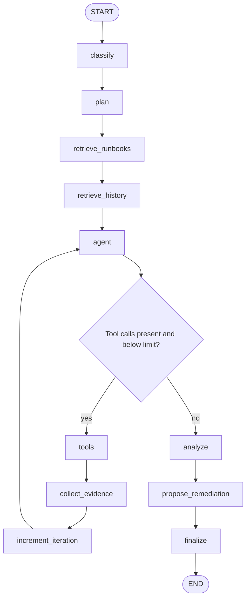

# Investigation Engine

## Graph topology

The investigation engine is a compiled LangGraph state machine.

The hard maximum is five tool iterations. The agent may stop earlier by
returning no tool calls.

## State contract

`InvestigationState` carries:

- incident ID and incident snapshot
- classification and generated plan
- additive LangChain message history
- collected evidence
- retrieved runbooks and historical investigations
- current and maximum tool iterations
- final analysis and remediation proposal
- assembled final result

## Node behavior

### Classify

Uses structured output with `IncidentClassification`. Expected prompt categories
are service degradation, outage, performance, database, network,
infrastructure, or unknown. Priorities are low, medium, high, or critical.
These values are prompt constraints, not Python enums.

### Plan

Uses a deterministic category-to-checklist mapping. This node does not call an
LLM.

### Retrieve runbooks

Builds a query from the incident and classification, embeds it, and returns the
three nearest runbook records by cosine distance.

### Retrieve history

Loads up to five recently completed investigations, excluding runs belonging to
the current incident. The current query is chronological, not semantic.

### Agent and tools

The tool-bound model sees the incident and plan. Its policy says to:

- use only the incident service or exact resource names discovered in evidence
- avoid guessing Kubernetes resources
- avoid duplicate calls without a reason
- correlate logs, pod state, deployment state, and events
- stop after enough evidence exists
- remain read-only

The ToolNode executes calls and returns ToolMessages. `collect_tool_evidence`
walks all ToolMessages, JSON-decodes text when possible, and records tool,
status, and finding.

Because it scans all accumulated messages after each tool cycle, evidence is
reconstructed from the full message history rather than appended incrementally.

## Available MCP tools

| Tool | Source | Returned evidence |
|---|---|---|
| `get_service_logs` | Kubernetes Pod logs | Last 50 lines per matching Pod |
| `get_service_metrics` | Metrics API | CPU and memory per container |
| `get_application_metrics` | Prometheus | Payment 5xx rate and p95 latency |
| `get_deployment_status` | Kubernetes Deployment | Replica health fields |
| `get_pod_status` | Kubernetes Pods | Phase, IP, readiness, restarts |
| `get_pod_events` | Kubernetes Events | Type, reason, message, count |

Kubernetes tools select pods with `app=<service>` in the supplied namespace.
Most Kubernetes API exceptions are returned as structured tool findings rather
than raised.

`get_application_metrics` currently uses payment metric names regardless of the
requested service argument. The service name is included in the response but
does not alter the PromQL.

## Analysis policy

The structured `InvestigationResult` contains a summary, confirmed facts,
possible causes, recommended checks, and confidence from 0 to 1.

The prompt enforces these evidence rules:

- runbooks are guidance, not live evidence
- history is context, not proof
- live evidence takes precedence
- failed guessed lookups do not establish a root cause
- resource saturation requires a threshold, limit, baseline, or signal
- symptoms must remain distinct from causes
- uncertainty must be explicit

## Proposal policy

The proposal node requests exactly one primary, reversible action and forbids
destructive actions. It always overwrites `requires_approval` to `true`, even if
the model returned `false`.

The proposal schema includes action, reason, target service, risk, command
preview, and approval requirement. A proposed action can be persisted even when
the server-side executor does not support it; unsupported actions fail safely at
execution time.

## Persistence behavior

The synchronous investigation endpoint creates a `RUNNING` row before graph
execution. On success it saves evidence, result fields, retrieved context, tool
count, and `COMPLETED`. A proposal initializes approval to `PENDING` and
remediation to `NOT_STARTED`. Any exception marks the run `FAILED`.

The SSE endpoint is different: it streams graph node progress but currently
does not create or persist an investigation run or return the final payload.
This is a documented current limitation.

## SSE event sequence

Possible event names are:

1. `investigation_started`
2. `classification_completed`
3. `plan_created`
4. `runbooks_retrieved`
5. `history_retrieved`
6. one or more `agent_updated`, `tools_executed`, `evidence_collected`, and
   `iteration_completed` events
7. `analysis_completed`
8. `remediation_proposed`
9. `investigation_finalized`
10. `investigation_completed`

The event data contains the node name, not the node output.
