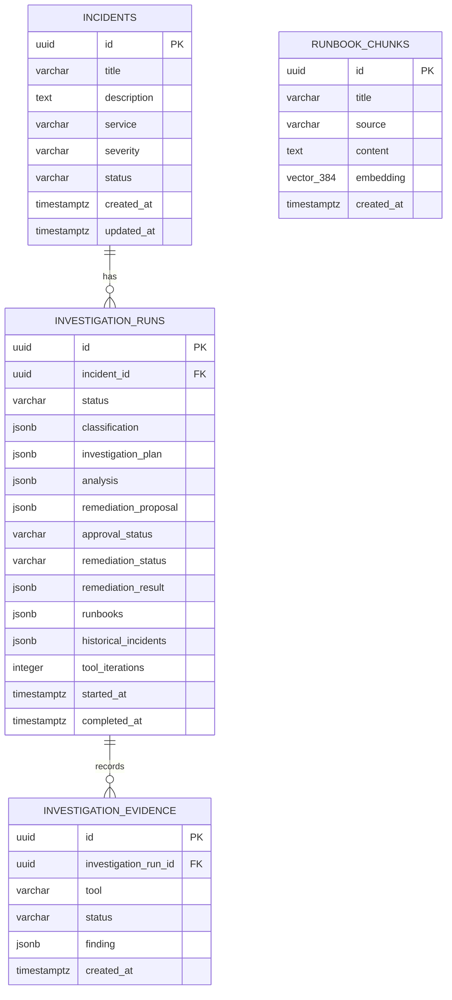
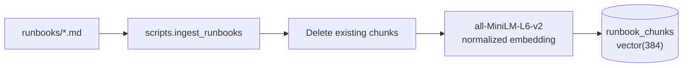

# Data Model and RAG

## Entity relationship model

Deleting an incident cascades to its runs; deleting a run cascades to its
evidence. Runbook records are independent.

## Storage choices

- UUIDs allow API-safe identifiers without exposing row counts.
- JSONB preserves evolving LLM payloads without frequent schema migrations.
- Evidence is stored separately for ordered audit and inspection.
- pgvector enables similarity ordering inside PostgreSQL.
- Timezone-aware timestamps are generated by PostgreSQL, except completed times
  assigned by the application in UTC.

## Migration order

1. Create `incidents`.
2. Add investigation runs and evidence.
3. Enable pgvector and create `runbook_chunks`.
4. Add remediation proposal.
5. Add approval, remediation status, and result.
6. Add persisted runbooks and historical context.

The backend Docker entrypoint runs `alembic upgrade head` before starting the
API.

## Runbook ingestion

Current ingestion behavior:

- Deletes all existing runbook rows on each run.
- Reads each Markdown file as one record; there is no sub-document chunking.
- Uses the filename stem as title and repository-relative path as source.
- Computes normalized 384-dimensional embeddings locally.
- Runs automatically in the backend container after migrations.

The embedding model is cached in-process with an LRU cache and its files are
cached in the Compose `huggingface_cache` volume.

## Retrieval

The incident title, description, service, and classification are combined into
a query. The query is embedded with the same model, and PostgreSQL orders rows
by cosine distance. The default limit is three.

No similarity score or threshold is returned. If the index contains at least
three documents, three are returned even if their relevance is weak.

## Historical incident memory

Historical context is loaded from the five most recent completed runs whose
`incident_id` differs from the current incident. Each context item includes run
ID, classification, analysis, and tool iteration count.

This is recent global history. It does not currently filter by service,
classification, embedding similarity, or confidence.

## Data ownership

- Incident and investigation records belong to `infra-pilot-postgres`.
- The demo payment database is a separate `prod-demo-postgres` instance.
- Compose volumes preserve platform data, demo data, Prometheus time series, and
  model downloads across `docker compose down`.
- `docker compose down -v` removes those named volumes.
