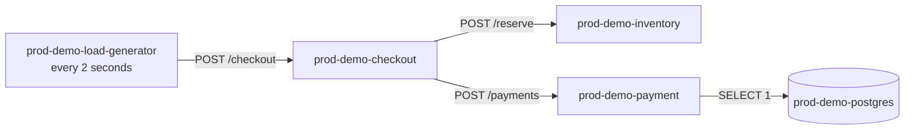

# Observability and Demo Environment

## Demo request path

Checkout fails when either downstream call returns an error. Payment readiness
and requests perform a real PostgreSQL connection. Inventory can inject delay or
readiness failure through environment variables.

## Demo endpoints

### Checkout

- `GET /health`
- `GET /ready`
- `POST /checkout`
- `GET /metrics/`

### Inventory

- `GET /health`
- `GET /ready`
- `POST /reserve`
- `GET /metrics/`

Environment controls: `DELAY_SECONDS` and `FAIL_READINESS`.

### Payment

- `GET /health`
- `GET /ready` with database connectivity check
- `POST /payments` with `SELECT 1`
- `GET /metrics/`

## Application metrics

Each HTTP service exposes a Prometheus counter and histogram:

- `payment_http_requests_total{status}`
- `payment_http_request_duration_seconds_*`
- `checkout_http_requests_total{status}`
- `checkout_http_request_duration_seconds_*`
- `inventory_http_requests_total{status}`
- `inventory_http_request_duration_seconds_*`

The Compose Prometheus server scrapes checkout, inventory, and payment every 15
seconds using static Docker DNS targets.

The dashboard currently displays Prometheus 5xx and p95 metrics only on the
`prod-demo-payment` inventory row.

## Kubernetes inventory algorithm

For a requested namespace, the backend:

1. Lists Deployments.
2. Lists Pods.
3. Attempts to list `metrics.k8s.io/v1beta1` Pod metrics.
4. Attempts to list warning Events.
5. Matches each Deployment to Pods using every `matchLabels` entry.
6. Aggregates readiness, replicas, restarts, CPU, memory, and warnings.
7. Marks a Deployment healthy only when desired replicas are nonzero and ready
   and available equal desired.
8. Queries Prometheus and enriches payment.

Metrics Server and Event failures are tolerated as empty data. Deployment or
Pod listing failures make the whole inventory request fail with HTTP 503.

## MCP evidence sources

The investigation agent can query:

- recent logs, 50 lines per Pod
- Pod status, IP, readiness, and restart count
- warning and normal Pod events
- Deployment replica status
- current container CPU and memory
- payment error-rate and p95 PromQL results

These are investigation-time snapshots, not a continuously stored telemetry
history in InfraPilot's database.

## Metrics Server

Metrics Server is optional for inventory but required for CPU and memory values.
Local Kind commonly needs `--kubelet-insecure-tls` because its kubelet serving
certificate is self-signed. This flag is acceptable only for the demo cluster.

## ServiceMonitor

`payment-service-monitor.yaml` is available for a Kubernetes cluster that has
the Prometheus Operator CRDs and a matching `release: monitoring` selector. The
Compose Prometheus instance does not use ServiceMonitor resources.

## Failure injection

`payment-service-broken.yaml` replaces the payment container with a Python
process that logs database timeout messages, waits two seconds, and exits with
status 1. Kubernetes repeatedly restarts it, creating CrashLoopBackOff evidence.

Restore with `infrastructure/kubernetes/demo/base/payment.yaml`.

## Current observability gaps

- No Alertmanager or automatic incident intake.
- No tracing or request correlation IDs.
- No InfraPilot application metrics endpoint.
- No long-term Kubernetes event/log retention.
- PromQL is payment-specific and not generated per service.
- No recording rules, dashboards, or alert rules in source control.
- Compose and Kind workloads are separate telemetry domains.
