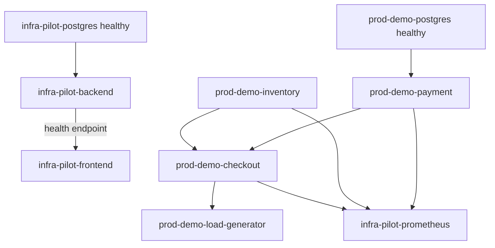

# Deployment and Operations

For copy-paste setup commands, use the root [README](../README.md). This document
explains why the deployment is structured this way.

## Docker Compose services

| Service | Image | Host port | Purpose |
|---|---|---:|---|
| `infra-pilot-frontend` | `infra-pilot/frontend:latest` | 3000 | Dashboard |
| `infra-pilot-backend` | `infra-pilot/backend:latest` | 8001 | API and agent |
| `infra-pilot-postgres` | `pgvector/pgvector:pg16` | 5432 | Platform data and vectors |
| `infra-pilot-prometheus` | `prom/prometheus:v3.5.0` | 9090 | Demo application metrics |
| `prod-demo-checkout` | `prod-demo/checkout:latest` | 8080 | Demo entry point |
| `prod-demo-payment` | `prod-demo/payment:latest` | 8081 | Payment and DB failure signal |
| `prod-demo-inventory` | `prod-demo/inventory:latest` | 8082 | Inventory dependency |
| `prod-demo-load-generator` | `prod-demo/load-generator:latest` | none | Continuous traffic |
| `prod-demo-postgres` | `postgres:16` | none | Payment database |

All published ports bind to loopback by default.

## Startup dependency graph



The backend container runs migrations and completely re-indexes runbooks before
starting Uvicorn. Model download can make the first health check slow.

## Persistent volumes

- `postgres_data`: incidents, investigations, evidence, and runbook vectors.
- `prod_demo_postgres_data`: Compose payment database.
- `prometheus_data`: Prometheus time series.
- `huggingface_cache`: sentence-transformer files.

`docker compose down` preserves them. `docker compose down -v` removes them.

## Kind deployment

The default cluster is one Kind control-plane node. Manifests create:

- namespace `prod-demo`
- one PostgreSQL replica
- two inventory replicas and one ClusterIP Service
- two payment replicas and one ClusterIP Service
- two checkout replicas and one ClusterIP Service
- one load-generator replica

Local demo images use `imagePullPolicy: IfNotPresent`. After rebuilding a
`latest` image, load it into Kind and restart the Deployment so new Pods use it.

The Kubernetes PostgreSQL Deployment has no PersistentVolumeClaim; its data is
ephemeral across Pod replacement.

## Backend-to-Kind connection

The backend receives the host kubeconfig through a read-only directory mount.
The kubeconfig's `127.0.0.1:<port>` endpoint is unreachable as localhost from
inside the container, so the client rewrites it to
`host.docker.internal:<port>`. TLS still validates against `localhost`.

Required values in Compose are:

```text
KUBERNETES_CONTEXT=kind-prod-demo-cluster
KUBERNETES_NAMESPACE=prod-demo
KUBERNETES_HOST_ALIAS=host.docker.internal
KUBERNETES_TLS_SERVER_NAME=localhost
```

## Lifecycle model

### One-time

Create Kind, build and load demo images, apply manifests, and install Metrics
Server. This remains until the cluster is explicitly deleted.

### Everyday

Start Compose and verify both Compose and Kubernetes. Compose shutdown does not
remove Kubernetes resources.

### Code update

- Backend/frontend change: rebuild the corresponding Compose image.
- Demo application change: rebuild Compose image, load it into Kind, and restart
  the Deployment.
- Manifest change: reapply the manifest.
- Runbook change: restart the backend or run the ingestion script.
- Database model change: add and apply an Alembic migration.

## Health and readiness

- Backend health calls `/api/v1/health` with a 90-second startup allowance.
- Frontend health fetches `/incidents` from the Next.js server.
- Demo services use `/ready`; payment readiness checks PostgreSQL.
- PostgreSQL uses `pg_isready`.
- Prometheus and load generator do not have Compose health checks.

## Reset boundaries

- `docker compose down`: remove Compose containers and network, retain volumes.
- `docker compose down -v`: additionally remove Compose data volumes.
- Delete demo manifests: remove Kubernetes workloads but retain the Kind cluster.
- `kind delete cluster --name prod-demo-cluster`: remove the entire cluster and
  all cluster-local state.

An existing Kind cluster cannot be renamed; it must be recreated under the new
name.
