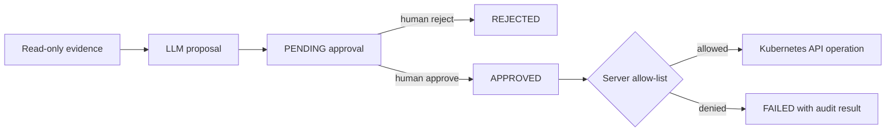

# Security and Remediation

## Safety objective

InfraPilot separates probabilistic reasoning from deterministic authorization.
The LLM may analyze evidence and propose an action, but application code decides
whether that action can run.

## Implemented controls

### Read-only investigation

The agent prompt forbids remediation during evidence collection. MCP tools read
logs, Pods, Deployments, Events, metrics, and Prometheus. They expose no mutation
tool.

### Mandatory approval

Every proposal is forced to `requires_approval=true`. A newly persisted proposal
starts as `PENDING` / `NOT_STARTED`. Execute rejects any run that is not
`APPROVED`.

### Server-side allow-list

`ALLOWED_ACTIONS` contains only `RESTART_DEPLOYMENT`. Unsupported actions return
a failure result. The executor ignores generated `commands` entirely.

### Deterministic restart

Restart patches a Deployment Pod-template annotation named
`infrapilot/restarted-at` with the current UTC timestamp. Kubernetes creates a
new ReplicaSet rollout without executing a shell command.

### State locking and audit

Approval and execution acquire a database row lock. Approval, remediation
status, and result are persisted and exposed through the audit endpoint.
Completed execution is idempotent.

## Trust boundaries

- Browser to API: untrusted user input enters incident and decision endpoints.
- API to Groq: incident text, evidence, runbook content, and history leave the
  local environment for model processing.
- API to Kubernetes: mounted kubeconfig credentials authorize reads and restart.
- MCP subprocess: inherits the backend environment, including credentials.
- Runbooks and infrastructure output: untrusted text is placed into prompts.
- PostgreSQL: durable record for operational and model-generated content.

## Current security gaps

### No authentication or authorization

Any client able to reach the API can create/delete incidents, run an
investigation, approve/reject a proposal, and execute an approved restart.
There are no users, roles, sessions, tokens, or approval identities.

### Broad kubeconfig access

The backend mounts the host's entire `.kube` directory. Effective permissions
depend on the selected context's credentials, not a dedicated least-privilege
service account.

### No target allow-list

The action is allow-listed, but the target service is any non-empty string. The
namespace is fixed to `prod-demo`, limiting scope, but production hardening
should also constrain Deployment names.

### Demo secrets

Database credentials are plaintext in Compose and Kubernetes manifests. They
are acceptable only for the local disposable demo.

### Prompt-injection surface

Logs, incidents, runbooks, and historical model output are inserted into LLM
prompts. The tool policy reduces unsafe behavior, but there is no content
sanitization, provenance scoring, or adversarial-prompt filter.

### External data processing

Investigation prompts can contain operational data and are sent to Groq. There
is no redaction layer for secrets, customer data, or sensitive log content.

### API and network controls

CORS permits local dashboard origins, but CORS does not protect direct API
calls. There is no rate limiting, TLS termination, CSRF defense, request-size
policy, or network authentication in the application.

## Production hardening priorities

1. Add identity, session/API authentication, and RBAC roles for viewer,
   investigator, approver, and executor.
2. Record actor identity, request ID, reason, and timestamp for every decision.
3. Replace host kubeconfig with a dedicated service account and minimal RBAC.
4. Add a target-resource allow-list and namespace policy.
5. Store secrets in a secret manager or Kubernetes Secrets with encryption.
6. Redact credentials and sensitive values before model calls and persistence.
7. Add prompt-injection defenses and explicit data provenance.
8. Add API TLS, rate limits, audit export, and tamper-resistant logs.
9. Introduce approval expiry and optional two-person control for higher risk.
10. Separate read and execute credentials and processes.

## Adding a remediation action safely

Before adding an action:

1. Define a typed proposal schema and deterministic parameters.
2. Prefer an SDK/API call over shell execution.
3. Validate namespace and exact target resource server-side.
4. Establish reversibility, timeout, and bounded blast radius.
5. Add authorization and approval rules appropriate to risk.
6. Persist before/after state and failure detail.
7. Add unit tests for denial, approval, idempotency, and failure.
8. Document the action and operator rollback procedure.
